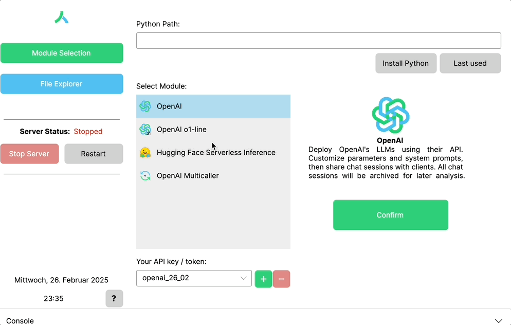
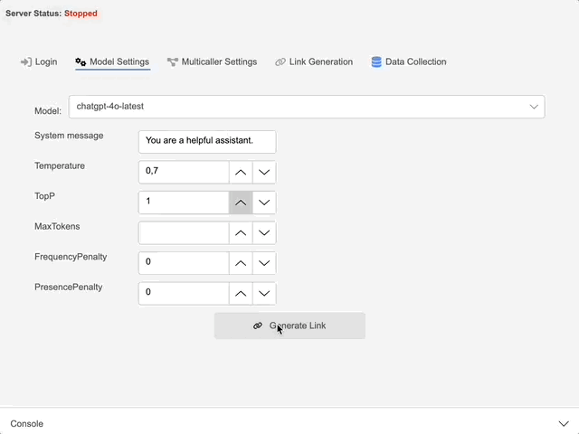

<!-- 
README.md

This README serves as the main landing page for our project. Later, when we switch the repository to public, this should provide an overview of the application, download links for various platforms, and links to documentation files.
-->

  <picture>
    <source srcset="LLMR/Assets/logo/logo_full_dark.png" media="(prefers-color-scheme: dark)">
    
  </picture>

# LLMRunner

*Effortless Model Deployment and Customization*

---

LLMR is an open-source application for empirically investigating interactions with various large language models (LLMs). As a client-server solution, LLMR offers easy access to a variety of different LLMs. Subjects can chat with the LLM directly via a browser-based chat interface without having to register. All chat transcripts are automatically recorded, clearly managed in the integrated explorer and can be exported at any time. 

  
  <!--   -->

LLMR integrates seamlessly with both Hugging Face’s Serverless Inference API and OpenAI’s API, providing access to a wide range of models, including the latest versions of ChatGPT. With LLMR, you can fine-tune settings to optimize performance and output for specific scenarios with ease.

## 🔍 How It Works  
LLMR operates as a server running locally on the researcher’s machine. Once a model is selected, students, pupils, and other participants can access the chat interface via a **public link—no registration or login required**.

---

## 🚀 A (pre-alpha) Student Project
Before you judge our code too harshly, please consider our humungous core development team that consists of exactly **two** people:  

👨‍💻 **Moritz Seibold** – Development, Co-Testing, Planning, Coordinating, and whatever else was necessary  
🧑‍💻 **Jan Kodweiß** – Testing, Co-Development, Planning, Coordinating, and desperately searching for missing semicolons  

We are both **Mathematics students**, and while we love spending thoughts on how generative AI might (not) influence Mathematics Ed., occasionally we still lose battles against multivariate calculus. So, instead of laying all blame on us for missing **unit tests** or **bugs**, we kindly ask you to first take a look at [how innocent we look!](LLMR/Assets/GIFs/janMoritz.png). Feel free to contact us or contribute your fixes directly – we welcome feedback and suggestions for future releases. 

---

## ❤️ Built With & Thanks To  
LLMR wouldn't be possible without several amazing open-source projects, among them:  

- [**Gradio**](https://github.com/gradio-app/gradio) – For the web-based chat interface
- [**QuestPDF**](https://github.com/QuestPDF/QuestPDF) - For generating PDF output
- [**Avalonia UI**](https://github.com/AvaloniaUI/Avalonia) – For cross-platform desktop integration  
- [**OpenAI API**](https://platform.openai.com/docs/) – For accessing cutting-edge language models  
- [**Hugging Face Inference API**](https://huggingface.co/docs/api-inference/) – For running various open-source models  

Notice: We will add all dependencies and open-source projects we utilized for LLMRunner properly to the GitHub project in the first non-pre alpha release version!

---

## 🛠️ Our Next Steps  
Before presenting LLMR at an upcoming conference (with a **complete** documentation 📄), here are some major things we are currently working on:  

- [ ] **Refactoring** – Cleaning up our code, reducing redundancy with a focus on the wabbly marriage between Python and .NET  
- [ ] **Chat Interface** – Adding customization options for the client's chat interface  
- [ ] **Unit Testing** – Including automated test builds  
- [ ] **Improved UI/UX** – More features, more UX improvements, and fewer *“Something went wrong”* messages  
- [ ] **Customizable Export Options** – Options for efficient output file formatting (next to CSV & PDF)  

---

## 📌 About  
**LLMRunner (LLMR)** is an open-source client-server application designed to explore human interaction with large language models in education. With support for **Hugging Face’s Serverless Inference API** and **OpenAI’s API**, LLMR allows easy access to a variety of **state-of-the-art LLMs** via a simple, browser-based interface!  

