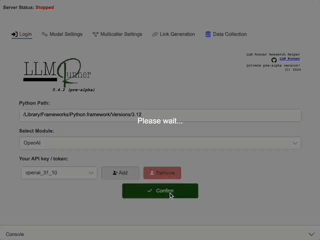

<!-- 
README.md

This README serves as the main landing page for our project. Later, when we switch the repository to public, this should provide an overview of the application, download links for various platforms, and links to documentation files.
-->

<div align="center">
  <picture>
    <source srcset="LLMR/Assets/logo_wide_DARK.png" media="(prefers-color-scheme: dark)">
    
  </picture>
</div>

# LLMRunner

*Effortless Model Deployment and Customization*

---

LLMR is an open-source application that allows you to deploy and manage Language Models (LLMs) through a user-friendly interface. Choose from various models via APIs, customize parameters like temperature and system prompts, and share interactive chat sessions with clients—all without writing a single line of code. 

<div align="center">
  
  
</div>

LLMR integrates seamlessly with both Hugging Face’s Serverless Inference API and OpenAI’s API, providing access to a wide range of models, including the latest versions of ChatGPT. Through this interface, you can fine-tune settings to optimize performance and output for specific needs. 

All chat histories are logged and archived locally, with easy export options available, including direct PDF generation for your records. Get started with LLMR today and simplify the way you deploy and share language models!


**ToDos:**

- [ ] Update download links 🔗 :smile:
- [ ] Upload pre-compiled binaries 🚀 :smile:

---

## Demo

<!-- 
 Moe: replace 'placeholder.gif' with actual GIF (LLMR running & qr code? (some pictures, ez, add nice text to it!)
-->
<!--  -->

[](https://www.youtube.com/placeholder)

*The demo covers installation on macOS (Apple Silicon), Windows 11 (x64), and Linux Mint (x64).*

**ToDos:**

- [ ] Add demo GIF and video link 🎥 :smile:

---

## Getting Started

### Installation Steps

1. **Download the Appropriate Version:**
   - Select the download link for your operating system from the [Downloads](#downloads) section.

2. **Install Python Dependencies:**
   - **macOS (Apple Silicon):**
     - [Watch Installation Tutorial](https://www.youtube.com/placeholder)
   - **Windows 11 (x64):**
     - [Watch Installation Tutorial](https://www.youtube.com/placeholder)
   - **Linux Mint (x64):**
     - [Watch Installation Tutorial](https://www.youtube.com/placeholder)

3. **Run the Application:**
   - Execute the downloaded binary and follow the on-screen instructions to start using **LLMR**.

### Configuration

- All configurations are stored locally on your device.
- No account creation or login is required, ensuring a seamless and secure experience.

---

## Dependencies

LLMR relies on several open-source packages and libraries. For detailed information on all dependencies and their licenses, refer to the following documents:

- [NuGet Packages Overview](NUGET_PACKAGES.md)
- [Python Packages Overview](PYTHON_PACKAGES.md)

**ToDos:**

- [ ] Verify dependency documentation 🔍 :smile:

### Programming Languages

- **C#**
- **Python**

### Frameworks and Libraries

- **.NET**
- **Avalonia**
- **MVVM**

---

## Contributing

<!-- 
Contributing.md

This section provides guidelines for contributing to our project. It includes instructions on how to fork the repository, create feature branches, commit changes, and open pull requests. It also references additional contributing guidelines (e.g. in the open source englightened spirit some 
-->

We welcome contributions to **LLMR**! Please follow these steps to contribute:

1. **Fork the Repository**
   - Click the "Fork" button at the top right of this repository to create your own copy.

2. **Clone Your Fork**
   ```bash
   git clone https://github.com/mmsbld/LLMR.git
   ```

3. **Create a Feature Branch**
   ```bash
   git checkout -b feature/YourFeature
   ```

4. **Commit Your Changes**
   ```bash
   git commit -m "Add Your Feature"
   ```

5. **Push to the Branch**
   ```bash
   git push origin feature/YourFeature
   ```

6. **Open a Pull Request**
   - Navigate to your fork on GitHub.
   - Click the "Compare & pull request" button.
   - Provide a clear description of your changes and submit the pull request.

**ToDos:**

- [ ] Schickes Logo designen (vielleicht mit AI Tool? [https://id.recraft.ai/realms/recraft/protocol/openid-connect/auth?client_id=frontend-client&scope=openid%20email%20profile&response_type=code&redirect_uri=https%3A%2F%2Fwww.recraft.ai%2Fapi%2Fauth%2Fcallback%2Fkeycloak&grant_type=authorization_code&state=kEaZp_9REBacg0F0sFbjhZxrocFRHqdPYNjwYQUEE7Y&code_challenge=jzmfaGbO5IBkSRM-ZiYS3WWN99AeNxYaFIld_sfu9e4&code_challenge_method=S256)]?)
- [ ] Betatesten & git Issues erstellen
- [ ] github Seite ("Homepage" (Readme.md), sonstige Dokumentation, Links, etc.) [Inspiration: einfach die github Seiten bekannter Projekte]
- [ ] C#.net-Entwicklung: PDF Output
- [ ] AXAML: UI Design
- [ ] Python: Skripte streamlinen (OOP in Python / kapseln? speziell die Teile der Skripte, die predict callen und das Speichern der history sicherstellen; TObi fragen?)


