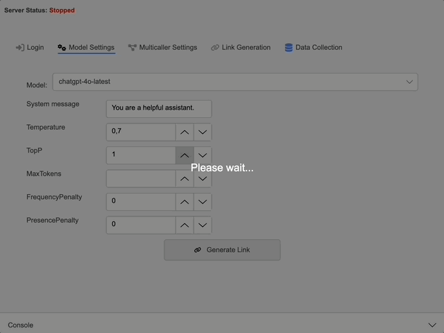

<picture>
  <source srcset="LLMR/Assets/logo_wide_DARK.png" media="(prefers-color-scheme: dark)">
  
</picture>

# LLMR

*Run and Share Language Models with Ease*

LLMR is an intuitive application that lets you select and run language models via APIs without needing to write code. Customize model parameters like temperature, top_p, and system prompts, and then share a link for clients to interact with the model—no login required on the client side. All chat histories are logged and archived locally, with built-in support for exporting PDFs. 

---

## Key Features

Choose models via Hugging Face's Serverless Inference API or OpenAI’s API.

Select from a variety of OpenAI's latest language models, including ChatGPT variants.

Generate a public link and QR code for clients to connect to a chatbot interface. No account needed.
